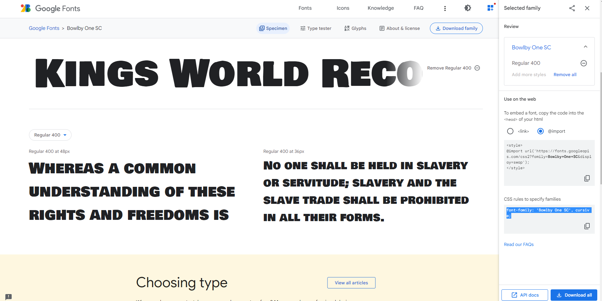
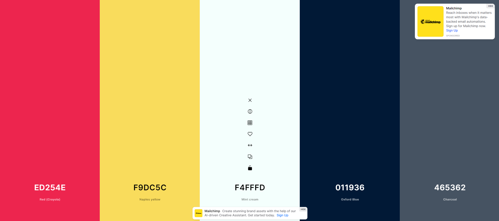

# Quiz

# Goal for this Project

This is a quiz application using HTML, CSS, and Javascript. This application emphasizes the use of Javascript to provide quiz questions and collect user data to determine whether the answers to a question are correct, this then generates a score and appends a final page of results from the user data.

This project has been deployed to GitHub Pages. To get this project up and running, you can follow the deployment link.

# Table of Contents
* [UX](#ux "UX")
    * [Summary](#Summary "Summary")
    * [Following Features](#This-project-has-the-following-features "This project has the following features")
    * [Psuedo code](#pseudo-code)
    * [Script Features](#This-project-has-script-features-of)
    * [Design Choices](#design-choices)
        * [Fonts](#fonts)
        * [Icons](#icons)
        * [Colours](#colours)
        
    * [Media Queries](#Media-Queries)
    * [Features](#Features)
    * [Credits](#Credits)

        * [Languages](#languages)
        * [Tools and Libraries](#tools-and-libraries)
    * [Testing](#testing)
        * [Unfixed Bugs](#unfixed-bugs)
    * [Deployment](#deployment)
# UX

## Summary
* HTML and CSS and Javascript documents create a quiz with multiple choice questions with Javascript trivia.
* This project emphasizes the use of using Javascript to make dynamic changes to an HMTL document.
* This project utilizes the use of appending HTML pages.

## This project has the following features:
* A Start Quiz button
* An appended HTML page that features questions, and multiple choice answers.
    + Answers are recording using an event listener, "click" and tracks correct answers.
* An appended HTML page that features:
    + Final score which is calculated using time remaining
    + A Summary of how many questions answered correctly
    + Input area to record initials
    + A Submit button
    + Submit buttom saves initials and score to local storage
* A Highscores HTML
    + This a list summary of intials and final top 5 scores
    + Go back button travels to the start of the quiz

## Psuedo code:
* Create a timer attached to a button with a starting value of 0
* When timer is pressed start a reverse countdown
* Create a 0 for countdown
* When countdown starts, start quiz
* Start Quiz will be on appended page
* Append the question: choices
* When user selects the right answer, color purple shows on the tab
* When user selects the right answer, color red shows on the tab
* Final score will keep track of how many the user got right
* Left over time will be deducted from final score
* Final Score Appended page
* Captures local storage
* Travels to another HTML
* Retrieved highscores

## Script features:
* Questions contained in an array variable with objects
* Variable declaration area
* An event listener (onclick) that generates time interval
* A function to render the questions and choices on the page using a for loop
* An event listener on all list choices
* A comparison statement to compare correct answers to choices
* An appended page showing the final stats of the individual user with input area for initials, captures local storage
* Highscores retreived local storage

## Design Choices
* Fonts
    + I have used Google Fonts to find a text that best seems fun and enjoyable. Bowlby One SC was chosen.
    
* Icons
    + I used some icons from the Font Awesome library. A star highlighting the highscores button. 
* Colours
    + I have used Coolors to help in the selection of my colour scheme.
    #f9dc5cff - This colour will be used as a background colour.
    #ed254eff - This colour will be used as the starting button on the landing page and also the progressbar during the quizgame.
    #000000 - This color will be used on all text.
    #FFFFFF -  This color will only be used to highlight the alternative buttons for the questions.
    #465362ff - This color will be used on the highscore button to separate from the play button.
    #2cd126 - This color will be used on the tabs form in the game.
    #5d0af8 - When clicked the right answer this color will be shown. 
    #fa0000 - When clicked the wrong answer this color will be shown. 
    

## This project has media Queries for:
* max-width: 980px
    + Adjusts body and container width
* max-width: 786px
    + Adjusts body and container width
    + Adjusts buttons
* max-width: 640px
    + Adjusts body and container width
    + Adjusts buttons and text
## Features:
* Four HTML Pages
    + Index.html
        * Contains landing page to start timer
        * Highscores page
* Highscores 
    + Retreives local data from previous page
* One CSS Page
    + Styles.css
        * Contains centering and styling for html list features
        * Contains media queries
* Two Javascript Page * Contains: * Variables, including arrays with object * Event listeners * if/else if statements * For Loops * Functions * Local Storage set and get

## Credits
For code inspiration, help and advice:
* Simen Daehlin
* Che Long Tran
 
For content and style insperation:
* James Q Quick
https://www.youtube.com/watch?v=u98ROZjBWy8&list=PLDlWc9AfQBfZIkdVaOQXi1tizJeNJipEx&index=1

\
&nbsp;
[Back to Top](#table-of-contents)
\
&nbsp;

fetch